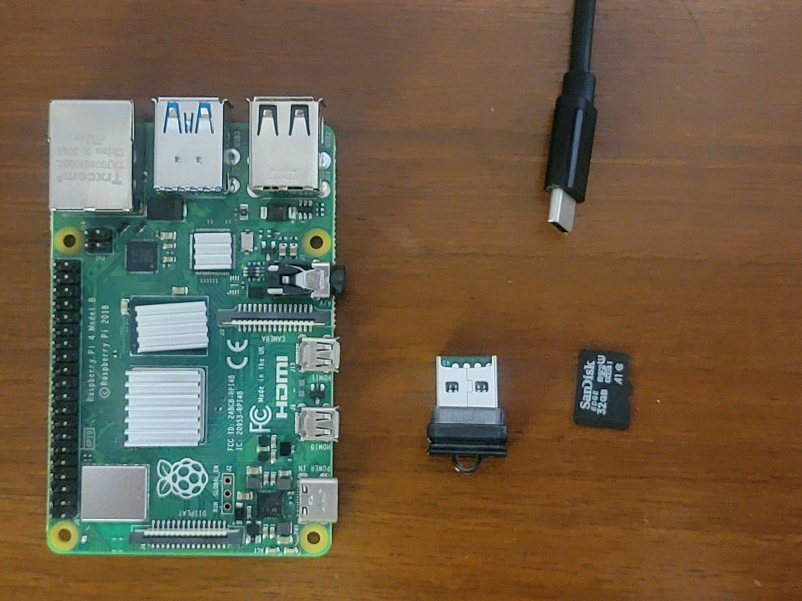

# RaspberryPi NAS Setup Guide
A walkthrough of setting up an extremely cheap, but effective home NAS (network attached storage) using a free software called openmediavault.  
  
## Preamble
Everyone needs a NAS. Whether you need network attached storage for a home office scenario, a media server, or anything else. You really dont know what you're missing until you try it. As someone with multiple machines all over the house, its nice to have one centeral place to drop files and be able to access them all over my network (and outside too). The RaspberryPi is a great way to test this concept out and on a budget too. Plus it uses opensource software and has endless accessories. Some upgrades let you run M.2 drives. Some let you setup full raid...ON A PI. So, without further ado, lets get right into it.  
  
## Heres What you'll need
   

### A RaspberryPi 3 or 4 with SD card and usb>sd interface
I am using the RaspberryPi 4 4gb model. I got a starter kit from Canakit a while back which came with all of the things needed to get it up and running (https://www.canakit.com/raspberry-pi-4-starter-kit.html) This guide will assume that is whats being used but this can work in multiple other ways and there are multiple other kits.  
Pi' are highly customisable. So mess around and have fun!  
  
### Some form of storage
I will be using a 2TB external hard drive from Seagate for now, but there are some cool board and case kits out there which allow m.2 and sata drives to be used in a pi. They also look great because it makes it a single, compact, and self contained setup. However, we are on a budget today.   

### Networking
It is best to run this over ethernet as there is lots of networking stuff happening behind the scenes (in terms of size). So, its best to keep it simple and just keep it over ethernet. Even if your Pi can do WiFi doesnt mean it should in this case.  

### The bare minimun to make this work is:
-a raspberry pi 3 or 4 with AT LEAST 2gigs of RAM  
-a 32gig SD card with USB SD card interface (included in most Pi kits)  
-a large external storage drive to hold all of your files  
-RaspberryPi OS lite image  
-RaspberryPi imager or some equivalant flashing software like Balena Etcher  

## Lets get started

### Step 1
Go to https://www.raspberrypi.com/software/ and download the RaspberryPi imager.   

Install the imager on your OS and start it up.  
Then..  
Take your SD card, put it into your usb interface, and plug it in to your machine.  
  
  
### Step 2
Now select the OS you want to flash to the SD card in the imager. In this case I am using PiOS lite 32bit because it is lightweight. 
Select the storage aparatus that is your SD card. BE CAREFUL NOT TO SELECT ANY OTHER DRIVE OTHER THAN THE ONE THAT YOU WILL BE USING!!!

BEFORE you click 'Write' make sure that you click the little gear icon at the bottom right. This allows you to setup things like your systems hostname (so you dont have to remember an IP), ssh keys, username, and password. 
  
OK. Now you can click 'Write'  
  
When your SD card is done being flashed, you may remove the usb interface from your machine and remove the SD card from the interface. Plug the SD card into the slot on the Pi along with the drive(s) you plan to use in this project. Also make sure you connect your ethernet. Finally you can connect the usb-c power cable and turn on your Pi. 
  
  
### Step 3
After a couple of minutes you should be able to access your Pi over SSH. So, fire up your terminal/command prompt and run the following command, putting your own username and hostname in from when you flashed the SD card.
'ssh username@hostname' or 'ssh username@IPaddress' << you can find the ip by looking at your router management portal  
You may also want to setup a static Ip address for the pi in your router's config. This is so DHCP wont give your Pi a new IP every so often and you can always come back to manage OMV at the same IP
  

  
### Step 4
Update and Upgrade  
  
``sudo apt update && sudo apt upgrade -y`` 
  

Reboot  
  
``sudo reboot``  
  
You will loose your SSH connection but once the pi reboots you can login again.  

### Step 5
Time to install OMV. OpenMediaVault is an opensource operating system designed to easily setup a NAS device on almost any type of hardware. Since we are using a RaspberryPi we need a more lightweight variant of OMV. Lucky for us, there is a fantastic github repo hosting a script made to get this up and running on the Pi (https://github.com/OpenMediaVault-Plugin-Developers/installScript)  

``wget https://github.com/OpenMediaVault-Plugin-Developers/installScript/raw/master/install``  
``chmod +x install``  
``sudo ./install -n``  

Run these three commands one after the other to download, modify, and execute the script (skipping the network setup portion because we already have that)
  
  
  
### Step 6
Access the web interface.  
First make sure nginx is running on your Pi  
  
``sudo systemctl status nginx``  
  
  
  
Now you can type that IP of your pi into your webbrowser.  
You should see a login screen. If not, try an incognito window. For some reason browser caching is weird with OMV at times.

  
  
Default credentials for OMV are as follows:  

username: ``admin``  
passwd: ``openmediavault``  

As soon as you get in, change the default password using the cogwheel in the top right of the web interface.

Also go to the 'Users' tab on the left side and select the users subgroup. Select the default user (likely called 'pi') and edit the user using the pencil icon.
In the edit user screen, give the user a password. This is different than the pi password. This username and password will allow you to access your SMB share later in the tutorial.

### Step 7  
Set up your disks.   
Click the storage tab in the left pane and select 'Disks'.   

  
  
You should see 2 disks by default. One will be the SD card hosting the OS. Dont worry about that one.   
Choose your storage drive (likely called /dev/sd*) and wipe it. Assuming you do not care about the data on it.  
If there is data on the disk that you care about, skip this part.  

Next, select the 'file systems' tab on the left. We will create a share on the disk we want to use.  
Select the + icon  

  
  
If you wiped your disk you will select 'Create'  
Then select your device and file system and hit 'Save'  
   
  
  
If you did not wipe your disk you will select 'Mount'and select your file system (aka the disk). 'Save'  
  
  
  
Comit your changes by hitting the Check Mark which will display in a yellow banner at the top of the screen. This happens every time you change something in OMV. You have the option to save or revert changes. 

### Step 8
Folders and Permissions

Within the Storage section, select 'Shared Folders'  
Create a new shared folder. You can name this whatever you want but make sure to select the correct file system.   
Hit 'Save'  

  
Still in shared folders, highlight your newly created shared folder (it will turn yellow) and hit the 'privileges' icon.
  
Give your default user and group Read/Write permissions. If you aim to access this share outside of your home network, its a good idea to create a secondary user with less system permissions, but I am not getting into that because there are some great articles on the OMV forums.  

  
  
Save and commit changes.  

### Step 9
Start SMB and Connect  
In the 'Services' tab on the left, select 'SMB/CIFS' and hit 'Shares'  

  

Hit the + symbol in the 'Shares' pane and select your previously created shared folder.  
Select the Enabled check box above your shared folder.  
You can leave everything else set to the default here.  

  
   
Hit 'Save'
  
Now go to the settings pane within the 'SMB/CIFS' tab. 
Enable the share.  
  
  
### Step 10
Now, on your Windows machine, make sure your Network Discovery is turned on. 
  
  
  
You should shortly see your RaspberryPi Nas pop up in the network section of your Windows File Explorer.  
  
  
  
Selecting the unit will prompt you for the OMV user password we created earlier.  
Type in your credentials to start using your new NAS.

###VERY IMPORTANT:Moving files already on the disk into your new share
DO NOT attempt to unplug your disk and move files into the share via another machine. This will absolutely wreck your share's permissions. Trust me. The best way to move files which were already on your disk into your new network share is to SSH into the Pi and find your share located at ``/srv/`` and recursively copy using ``sudo cp -r /srv/yourdiskname/yourfile /srv/yourdiskname/yourshare`` or move the files into your shared folder. This prevents the permissions between linux and windows from becoming all wonky and is much simpler anyways.

### Final words
I hope you have enjoyed this writeup and are loving your new RaspberryPi NAS as much as I enjoy mine. There are lots of other cool things which you can do with this sort of setup. Such as running a Plex server via your SMB share or backing up OS images. Just go hunt for the right writeups.  
  
If you need anything at all feel free to contact me via Github, LinkedIn or at my email listed on my profile. 
  
Thanks!  
  
RazElG00n

